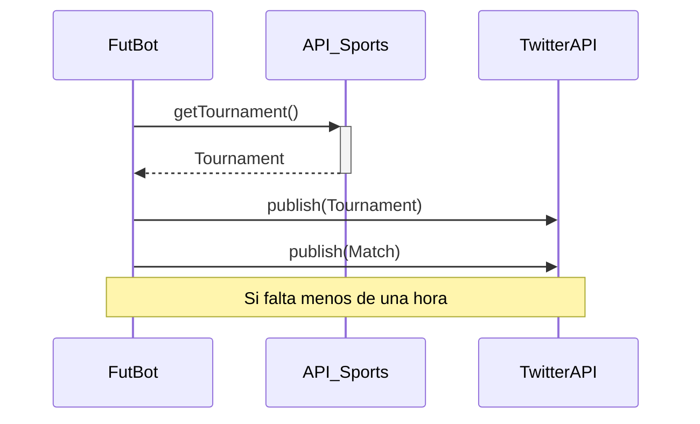

# FutBot

Bot que publica en **Twitter** los partidos del día correspondientes a los torneos especificados. Además, recuerda antes de cada uno de ellos.

> Dependencias:
> 
> - [Tweepy](https://www.tweepy.org/) (para conectarse a [TwitterAPI](https://developer.twitter.com/en/docs/twitter-api))
> - [Requests](https://docs.python-requests.org/)
> - [Pillow](https://pillow.readthedocs.io/)
> - [...](https://github.com/ljcanales/FutBot/blob/master/requirements.txt)

### Twitter Account

Follow [@FutBot_](https://twitter.com/FutBot_)

### Sequence Diagram

