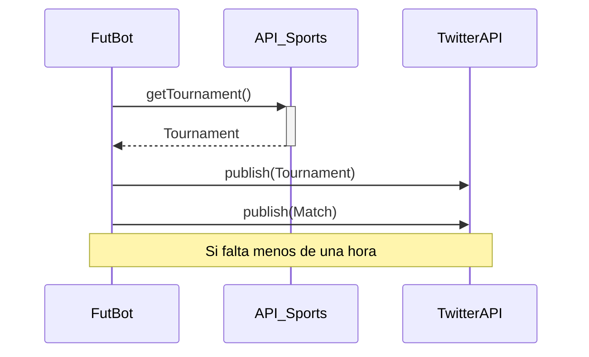

# FutBot

Bot que publica en **Twitter** los partidos del día de los torneos especificados. Y recuerda antes de cada uno de ellos.

### Twitter Account

Follow [@FutBot_](https://twitter.com/FutBot_)

### Sequence Diagram

